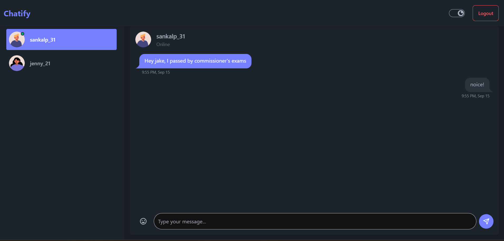

# Chatify

A real-time chat application built using the MERN stack (MongoDB, Express.js, React.js, Node.js). Users can sign in and chat with other registered users.




## Features

- **User Authentication**: Secure sign-up and login functionality.
- **Real-Time Messaging**: Instant messaging with other users.
- **Emoji Support**: Enhance your messages with emojis.

## Technologies Used

### Front-End

- **React.js**: Front-end library for building user interfaces.
- **Redux Toolkit**: State management for React applications.
- **Axios**: Promise-based HTTP client for the browser.
- **React Router DOM**: Declarative routing for React.
- **Socket.io Client**: Real-time bidirectional event-based communication.
- **Tailwind CSS**: Utility-first CSS framework.
- **DaisyUI**: Tailwind CSS Components.

### Back-End

- **Node.js**: JavaScript runtime environment.
- **Express.js**: Web framework for Node.js.
- **MongoDB**: NoSQL database program.
- **Mongoose**: MongoDB object modeling tool.
- **Socket.io**: Enables real-time, bidirectional communication.
- **JSON Web Tokens (JWT)**: Secure authentication.
- **Bcrypt**: Password hashing function.
- **Dotenv**: Loads environment variables from a `.env` file.

## Prerequisites

- **Node.js** (v14 or higher)
- **MongoDB** (Local installation or cloud-based)

## Installation

### Clone the Repository

```bash
git clone https://github.com/sankalp51/Chatify.git
cd chatify
```

### Set Up the Server

1. **Navigate to the server directory:**

    ```bash
    cd server
    ```

2. **Install Dependencies:**

    ```bash
    npm install
    ```

3. **Create a `.env` File:**

    Create a `.env` file in the server directory and add the following:

    ```env
    DATABASE_URL=your-mongodb-connection-string
    JWT_SECRET=your-jwt-secret
    ```

4. **Create a `.env` File:**

    Create a `.env` file in the client directory and add the following:

    ```env
    VITE_API_BASE_URL=your-rest-api-base-url
    ```

5. **Start the Server:**

    ```bash
    npm run dev
    ```

### Set Up the Client

1. **Navigate to the client directory:**

    ```bash
    cd ../client
    ```

2. **Install Dependencies:**

    ```bash
    npm install
    ```

3. **Start the Client:**

    ```bash
    npm run dev
    ```

## Usage

- Open your browser and navigate to `http://localhost:5173` (or the port specified by Vite).
- Sign up for a new account or log in if you already have one.
- Start chatting with other registered users in real-time.

## Scripts

### Server Scripts

- **Start Server in Development Mode:**

    ```bash
    npm run dev
    ```

- **Start Server in Production Mode:**

    ```bash
    npm start
    ```

### Client Scripts

- **Start Client in Development Mode:**

    ```bash
    npm run dev
    ```

- **Build Client for Production:**

    ```bash
    npm run build
    ```

- **Preview Production Build:**

    ```bash
    npm run preview
    ```

## Dependencies Overview

### Client Dependencies

- **@reduxjs/toolkit**
- **axios**
- **classnames**
- **date-fns**
- **emoji-picker-react**
- **lodash.debounce**
- **react**
- **react-dom**
- **react-icons**
- **react-redux**
- **react-router-dom**
- **socket.io-client**
- **sonner**

### Client Dev Dependencies

- **@types/react**
- **@types/react-dom**
- **@vitejs/plugin-react**
- **autoprefixer**
- **daisyui**
- **eslint**
- **eslint-plugin-react**
- **eslint-plugin-react-hooks**
- **eslint-plugin-react-refresh**
- **postcss**
- **tailwindcss**
- **vite**

### Server Dependencies

- **bcrypt**
- **cookie-parser**
- **cors**
- **dotenv**
- **express**
- **jsonwebtoken**
- **mongoose**
- **socket.io**

## License

This project is licensed under the **ISC License**.

## Contributing

Contributions are welcome! Please open an issue or submit a pull request for any improvements.

## Contact

For any questions or suggestions, please contact [sankalpkalangutkar31@gmail.com](mailto:sankalpkalangutkar31@gmail.com).

---

**Note:** Replace placeholders like `your-mongodb-connection-string`, `your-jwt-secret`, `path/to/your/image.png`, and contact information with your actual details.
