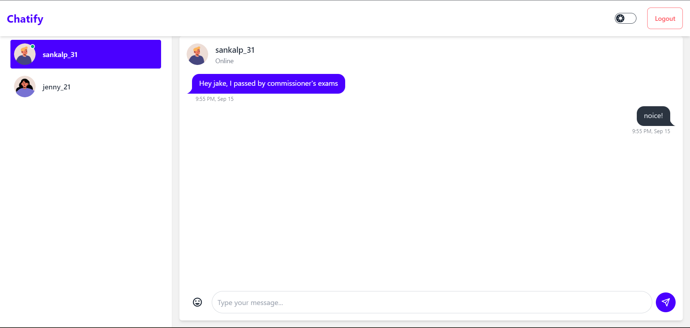
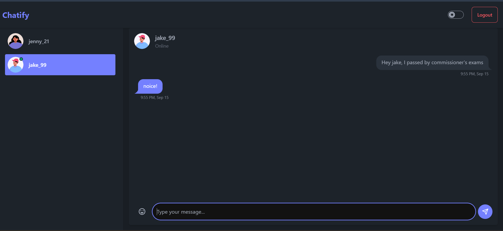

# Chatify

A real-time chat application built using the MERN stack (MongoDB, Express.js, React.js, Node.js). Users can sign in and chat with other registered users.




## Features

- **User Authentication**: Secure sign-up and login functionality.
- **Real-Time Messaging**: Instant messaging with other users.
- **Emoji Support**: Enhance your messages with emojis.

## Technologies Used

### Front-End

- **React.js**: Front-end library for building user interfaces.
- **Redux Toolkit**: State management for React applications.
- **Axios**: Promise-based HTTP client for the browser.
- **React Router DOM**: Declarative routing for React.
- **Socket.io Client**: Real-time bidirectional event-based communication.
- **Tailwind CSS**: Utility-first CSS framework.
- **ShadCN**: Prebuilt Components.
- **Tanstack Query**: Powerful data fetching and mutation library.
- **Framer Motion**: Animation library for React.
- **Lucide React**: Icon library.
- **Zod**: Schema validation library.
- **React Hook Form**: Library for forms and validation.
- **Sonner**: Notification library.
- **Input OTP**: OTP input field.

### Back-End

- **Node.js**: JavaScript runtime environment.
- **Express.js**: Web framework for Node.js.
- **MongoDB**: NoSQL database program.
- **Mongoose**: MongoDB object modeling tool.
- **Socket.io**: Enables real-time, bidirectional communication.
- **JSON Web Tokens (JWT)**: Secure authentication.
- **Bcrypt.js**: Password hashing function.
- **Dotenv**: Loads environment variables from a `.env` file.
- **Ioredis**: Redis client for session and data caching.
- **Cloudinary**: Cloud storage for media assets.
- **Multer**: Middleware for handling file uploads.
- **Nodemailer**: Email sending library.
- **Sharp**: Image processing library.

## Prerequisites

- **Node.js** (v14 or higher)
- **MongoDB** (Local installation or cloud-based)

## Installation

### Clone the Repository

```bash
git clone https://github.com/sankalp51/Chatify.git
cd chatify
```

### Set Up the Server

1. **Navigate to the server directory:**

    ```bash
    cd backend
    cd backend
    ```

2. **Install Dependencies:**

    ```bash
    npm install
    ```

3. **Create a `.env` File:**

    Create a `.env` file in the server directory and add the following:

    ```env
    DATABASE_URL=your-mongodb-connection-string
    ACCESS_TOKEN_SECRET=your-access-token-secret
    REFRESH_TOKEN_SECRET=your-refresh-token-secret
    REDIS_URL=your-redis-connection-string
    CLOUDINARY_URL=your-cloudinary-connection-string
    EMAIL_HOST=your-email-host
    EMAIL_USER=your-email-user
    EMAIL_PASS=your-email-password
    ```

4. **Start the Server:**

    ```bash
    npm run dev
    ```

### Set Up the Client

1. **Navigate to the client directory:**

    ```bash
    cd ./frontend
    cd ./frontend
    ```

2. **Install Dependencies:**

    ```bash
    npm install
    ```

3. **Create a `.env` File:**

    Create a `.env` file in the client directory and add the following:

    ```env
    VITE_API_BASE_URL=your-rest-api-base-url
    ```

4. **Start the Client:**

    ```bash
    npm run dev
    ```

## Usage

- Open your browser and navigate to `http://localhost:5173` (or the port specified by Vite).
- Sign up for a new account or log in if you already have one.
- Start chatting with other registered users in real-time.

## Scripts

### Server Scripts

- **Navigate to the server directory:**

    ```bash
    cd ./backend
    cd ./backend
    ```

- **Start Server in Development Mode:**

    ```bash
    npm run dev
    ```

- **Start Server in Production Mode:**

    ```bash
    npm start
    ```

### Client Scripts

- **Start Client in Development Mode:**

    ```bash
    npm run dev
    ```

- **Build Client for Production:**

    ```bash
    npm run build
    ```

- **Preview Production Build:**

    ```bash
    npm run preview
    ```

## Dependencies Overview

### Client Dependencies

- **@reduxjs/toolkit**
- **@hookform/resolvers**
- **@tanstack/react-query**
- **axios**
- **classnames**
- **clsx**
- **date-fns**
- **emoji-picker-react**
- **framer-motion**
- **input-otp**
- **lucide-react**
- **react**
- **react-dom**
- **react-hook-form**
- **react-icons**
- **react-redux**
- **react-router-dom**
- **socket.io-client**
- **sonner**
- **tailwind-merge**
- **tailwindcss-animate**
- **zod**

### Client Dev Dependencies

- **@eslint/js**
- **@types/node**
- **@types/react**
- **@types/react-dom**
- **@vitejs/plugin-react**
- **autoprefixer**
- **eslint**
- **eslint-plugin-react-hooks**
- **eslint-plugin-react-refresh**
- **globals**
- **postcss**
- **tailwindcss**
- **typescript**
- **typescript-eslint**
- **vite**

### Server Dependencies

- **bcryptjs**
- **cloudinary**
- **cookie-parser**
- **cors**
- **dotenv**
- **express**
- **ioredis**
- **jsonwebtoken**
- **mongoose**
- **multer**
- **nodemailer**
- **sharp**
- **socket.io**

## License

This project is licensed under the **ISC License**.

## Contributing

Contributions are welcome! Please open an issue or submit a pull request for any improvements.

## Contact

For any questions or suggestions, please contact [sankalp.kalangutkar31@gmail.com](mailto:sankalp.kalangutkar31@gmail.com).

---

**Note:** Replace placeholders like `your-mongodb-connection-string`, `your-jwt-secret`, `path/to/your/image.png`, and contact information with your actual details.

